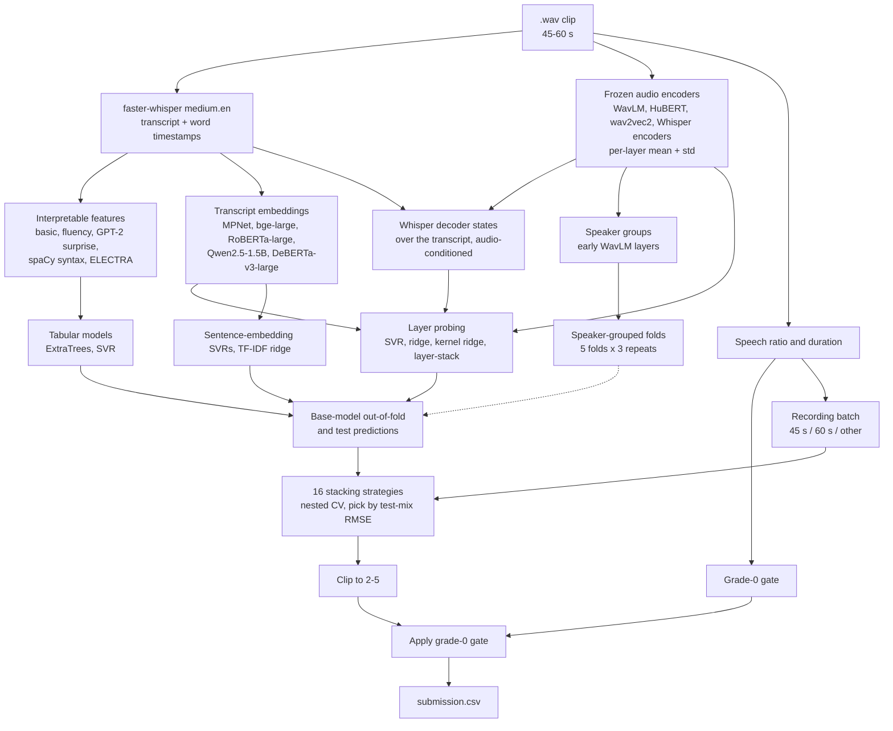

# Spoken Grammar Scoring Engine

Predicts a grammar score from **0 to 5** for a 45–60 second spoken-English audio clip. The system transcribes each clip, extracts features from both the audio and the transcript, trains many small models on frozen pretrained representations, and blends them with a stacked ensemble.

Everything lives in one notebook: [`grammar_scoring_engine_v5_kaggle.ipynb`](grammar_scoring_engine_v5_kaggle.ipynb). It is written for Kaggle (GPU T4, internet on).

> **Status of v5.** The v5 additions (speaker-grouped CV, grade-0 gate, recording-batch stacking, Whisper-decoder features) were code-reviewed and tested on synthetic data of the same shape. The GPU cells had not been run on the real clips when the notebook was written. Fill in the [Results](#results) table from `outputs/run_summary.json` after a full run, and do not compare v5's speaker-grouped CV numbers with the v1/v2 random-fold numbers.

---

## Contents

1. [Task and data](#task-and-data)
2. [Design decisions](#design-decisions)
3. [Architecture](#architecture)
4. [Pipeline in detail](#pipeline-in-detail)
5. [Repository layout](#repository-layout)
6. [Running it](#running-it)
7. [Configuration](#configuration)
8. [Outputs](#outputs)
9. [Results](#results)
10. [Limitations](#limitations)
11. [Future work](#future-work)
12. [Acknowledgements](#acknowledgements)

---

## Task and data

| | |
|---|---|
| Input | one `.wav` clip, 45–60 s of spoken English |
| Output | continuous grammar score in `[0, 5]` (MOS-style Likert rubric) |
| Training data | 769 labelled clips (`train.csv` + `train/`) |
| Test data | 216 clips (`test.csv` + `test/`) |
| Metrics | RMSE and Pearson correlation |

The data is **not** included in this repository. Attach the competition dataset to the Kaggle notebook (see [Running it](#running-it)).

Dataset quirks found during the audit, all of which shape the design:

- **37 training clips have label `0`.** That is outside the 1–5 rubric. They come from a separate filename range, have much lower ASR confidence, and are recorded differently (loud from start to finish). Models are trained only on the 732 rubric-valid clips (`label > 0`); the zero clips are handled by a separate gate.
- **`sample_submission.csv` may not match `test.csv`** (204 vs 216 rows in an earlier run). The submission is built in `test.csv` order and checked against the audio files.
- **Train and test reuse file names for different audio.** Every cache is keyed by position or `(split, filename)`, never by file name alone.

---

## Design decisions

**1. Use every layer, not just the last.** Self-supervised speech models are tuned for their pretraining objective in the last layer; intermediate layers usually carry more phonetic and lexical information. Each backbone is frozen, every hidden layer is mean+std pooled over time, and small heads are fitted on top. Layer choice happens inside each training fold, so it never sees validation labels.

**2. Speaker-grouped cross-validation.** Training clips come in groups of about three from the same speaker with near-identical grades, and test speakers never appear in training. Random folds leak speaker identity and flatter audio models. Folds here keep inferred speaker groups together (`StratifiedGroupKFold`). Groups are inferred from early WavLM layers, which mostly encode voice: training clips whose voice similarity exceeds the 99.5th percentile of test→train similarities are linked, and connected components become groups.

**3. Grade-0 gate.** The share of 25 ms frames with RMS > 0.02 (the "speech ratio") separates the grade-0 clips from graded clips. The threshold is derived from training data, and the gate switches itself off unless separation is perfect. Test clips above the threshold are set to 0. One wrongly gated clip is expensive, so the notebook prints the gated clips for inspection.

**4. Recording-batch awareness.** A batch of clips that are exactly about 45.06 s long is a small share of training but a large share of test, with lower grades. The notebook reports error per batch, selects the final stacker on a **test-mix-weighted** RMSE, and offers batch-split stackers that are partially pooled with a global stacker. Predictions are clipped to `[2, 5]` when grades below 2 are under 1.5% of graded clips.

**5. Stacking for variance control.** There are roughly 40–50 correlated base models and only about 730 labels. The stacker's main job is to keep variance down: non-negative weights, family-level averaging, bagging, and greedy selection are all compared by nested CV.

---

## Architecture



### Stages at a glance

| Stage | Notebook section | What it does |
|---|---|---|
| Setup | 1 | Environment check, config, seeding, dataset discovery, optional cache warm start |
| Data audit | 2 | Validates files, label distribution, durations, zero-label rows |
| ASR | 3 | Resumable Whisper transcription with word timestamps |
| Batches and gate | 3b | Recording-batch codes, speech ratio, grade-0 gate, prediction clip floor |
| Features | 4 | Basic/lexical, fluency, GPT-2 surprise, spaCy syntax, ELECTRA |
| Audio embeddings | 5 | Per-layer mean+std from frozen encoders, cached as float16 |
| Decoder view | 5b | Whisper decoder hidden states over the transcript |
| Text embeddings | 6 | Sentence encoders and layer-wise frozen language-model features |
| Infrastructure | 7 | Speaker groups, folds, layer ranking, probe heads, caching registry |
| Base models | 8 | Trains every model family under repeated CV |
| Stacking | 9 | 16 strategies, nested CV, selection, bootstrap interval |
| Training RMSE | 9b | Resubstitution RMSE next to the out-of-fold estimate |
| Submission | 10 | Final predictions, gate, validated CSV |
| Analysis | 11 | Plots, per-batch error, leave-one-family-out ablation, feature importance, worst errors |
| Robustness | 12 | Speaker-leakage check, independent zero-regime detector |

---

## Pipeline in detail

### 1. Transcription (Section 3)

`faster-whisper` with `medium.en` (float16, falling back to int8_float16), beam size 5, VAD filter with 500 ms minimum silence, and word timestamps. For each clip the cache stores the transcript, language probability, segment and word counts, average log-probability, no-speech probability, mean word probability, speech span and the full word list as JSON. The cache is written every 20 clips and failed clips are retried. Every transcript-derived cache is tagged with a hash of all transcripts, so changing the ASR setup invalidates them automatically.

### 2. Interpretable features (Section 4)

| Family | Examples |
|---|---|
| Basic and lexical | word and character counts, ASR confidence, type/token ratio, filler ratio, subordinator and coordinator ratio, repetition ratio, words per sentence |
| Fluency | pause rate at 0.3 / 0.6 / 1.0 s, gap statistics, pause-time ratio, articulation rate, word-duration spread, low-confidence word ratio, leading and trailing silence |
| Language-model surprise | GPT-2 medium token and sentence negative log-likelihood (mean, median, q90, share of tokens above thresholds) |
| Syntax (spaCy) | sentences without subject or finite verb, parse depth, clause rate, passive rate, sentence-length spread, POS mix |
| ELECTRA | per-token "replaced" probability from `electra-large-discriminator` as a direct signal of locally ungrammatical tokens |

Missing values are imputed with training-set medians only.

### 3. Frozen audio backbones (Section 5)

| Key | Model | Notes |
|---|---|---|
| `wavlm_base_plus` | `microsoft/wavlm-base-plus` | required |
| `wavlm_large` | `microsoft/wavlm-large` | required |
| `whisper_medium_enc` | `openai/whisper-medium.en` encoder | required |
| `whisper_large_v3_enc` | `openai/whisper-large-v3` encoder | optional |
| `whisper_small_enc` | `openai/whisper-small.en` encoder | optional |
| `hubert_large` | `facebook/hubert-large-ll60k` | optional |
| `wav2vec2_asr_large` | `facebook/wav2vec2-large-960h-lv60-self` | optional |

Clips are cut into 15 s chunks (SSL models) or 30 s chunks (Whisper). Per-chunk mean and variance of every hidden layer are combined exactly (duration-weighted mean, pooled variance), giving a `[clips, layers, 2·dim]` array. Whisper's 30 s padding frames are excluded from pooling. Optional backbones that fail to load are skipped and the run continues.

### 4. Whisper decoder view (Section 5b)

The encoder views never see the transcript. Here Whisper's decoder is run over the ASR transcript with teacher forcing, cross-attending to the matching 30 s of audio. Each word is assigned to the window it starts in, and decoder states are mean/std pooled over transcript tokens in the same format as the audio backbones. Optional.

### 5. Transcript embeddings (Section 6)

- Sentence embeddings: **MPNet** (`all-mpnet-base-v2`) and **bge-large-en-v1.5**, each fed to an SVR together with the basic numeric features.
- Layer-wise frozen language models, probed like audio: **RoBERTa-large**, **Qwen2.5-1.5B** (first "attention-sink" token excluded from pooling) and **DeBERTa-v3-large**.

### 6. Layer probing without leakage (Section 7)

For each training set, a `LayerRanking` scores every (layer, pooling) pair by the **exact leave-one-out error of ridge regression**, computed in closed form from one eigendecomposition. Four heads then share that single ranking, and all selection of layers, `k`, `C`, `γ` and `α` happens inside `fit()` on the training fold only.

| Head | Uses | Selected by |
|---|---|---|
| `svr` | top-k layers concatenated, RBF SVR | 3-fold inner CV over (k, C) |
| `ridge` | same layers, linear ridge | inner CV over (k, α) |
| `krr` | same layers, RBF kernel ridge | exact LOO over (k, γ, α) |
| `lstack` | all layers: one ridge each, non-negative weights on their LOO predictions | LOO |

### 7. Base models (Section 8)

| Model | Input |
|---|---|
| `tfidf_ridge` | word and character TF-IDF plus numeric features |
| `mpnet_svr`, `bge_large_svr` | sentence embedding plus numeric features |
| `handcrafted_et`, `handcrafted_svr` | all interpretable features (trees and kernel) |
| `probe_<audio backbone>_{svr,ridge,krr,lstack}` | audio layers |
| `probe_<text backbone>_{svr,ridge,krr,lstack}` | transcript layers |
| `deberta_ft` | fine-tuned DeBERTa-v3-base, one repeat (off by default) |

Every model is evaluated the same way: fit on four folds, predict the fifth (out-of-fold) and predict the test set. Out-of-fold predictions are averaged over repeats, and so are the test predictions from all fold models, so the stacker learns from inputs with the same character as the test inputs it will blend. Predictions are cached on disk under a key that includes the fold hash.

### 8. Stacking (Section 9)

Sixteen strategies are scored by nested CV, repeated over every fold set.

| Strategy | Idea |
|---|---|
| `mean_affine`, `best_single_affine` | baselines: average of everything, or best single model, each linearly calibrated |
| `nnls` | non-negative linear stack |
| `bagged_nnls` | NNLS averaged over 60 bootstrap resamples |
| `family_nnls`, `family_bagged` | heads of one backbone are averaged first, so there is one weight per backbone |
| `caruana` | greedy forward selection with replacement, plus affine calibration |
| `…+poly2`, `…+iso_half` | monotone recalibration (quadratic or half-isotonic) fitted on inner out-of-fold stack predictions |
| `batch_nnls`, `batch_bagged_nnls`, `batch_family_nnls`, `batch_family_bagged`, `batch_family_bagged_full` | separate stackers for the 45 s batch and all other clips, optionally blended 50/50 with a global stack |

The strategy with the lowest test-mix-weighted nested RMSE is used (`SELECT_BY="testmix"`). Choosing the best of 16 is a mild selection effect (roughly 0.003–0.006 RMSE), so a 2,000-resample bootstrap interval over clips is printed alongside.

### 9. Training RMSE (Section 9b)

The competition requires RMSE on the training data. The notebook reports two numbers and labels them clearly:

- **Training (resubstitution) RMSE:** every base model is refitted on all rubric-valid clips and predicts those same clips. Optimistic by construction; reported because it is required.
- **Out-of-fold (nested CV) RMSE:** each clip is predicted by models that never saw it. This is the number to use for expected performance on unseen data.

---

## Repository layout

```
.
├── grammar_scoring_engine_v5_kaggle.ipynb   # the whole pipeline
├── README.md
├── requirements.txt
├── .gitignore
└── docs/                                    # optional: plots exported from a real run
```

Data, caches and outputs are intentionally not tracked (see `.gitignore`).

---

## Running it

### On Kaggle (intended path)

1. Create a notebook and upload `grammar_scoring_engine_v5_kaggle.ipynb`.
2. **Settings → Accelerator → GPU (T4 recommended)** and **Internet → On**.
3. **Add Input** → the competition dataset. The notebook looks for `train.csv`, `test.csv`, `train/` and `test/` under `/kaggle/input/` and finds them automatically. To point it elsewhere, set `GRAMMAR_DATA_DIR`.
4. Optional warm start: attach an earlier run's `cache/` (or `asr_transcripts_medium_en.csv`) as a Kaggle Dataset. It is copied in automatically and the roughly one-hour Whisper stage is skipped.
5. **Save & Run All.** Expensive stages are cached and resumable within a session.

Caches go to `/kaggle/working/cache/`, outputs to `/kaggle/working/outputs/`, and the final file is also copied to `/kaggle/working/submission.csv`.

### Run time (estimates, not measured)

| Stage | Approx. time on a T4 |
|---|---|
| Whisper transcription | about 1 h (skipped with a transcript cache) |
| Whisper-decoder extraction | 10–15 min |
| CV for all heads, 3 repeats | 40–60 min of CPU time |
| DeBERTa fine-tuning (if enabled) | about 20 min |

Set `N_REPEATS = 1` for a quick first pass.

### Elsewhere

The notebook raises an error if `/kaggle/input` does not exist. To run it on another machine, replace the path constants in Section 1 and keep the same four data items.

---

## Configuration

Set at the top of Section 1.

| Flag | Default | Meaning |
|---|---|---|
| `N_SPLITS`, `N_REPEATS` | 5, 3 | folds per repeat, number of repeats with different seeds |
| `CV_MODE` | `"speaker"` | `"speaker"`: inferred speaker groups, `"group"`: `file_number // GROUP_SIZE`, `"random"`: leaky folds |
| `SPEAKER_PERCENTILE` | 99.5 | voice-similarity percentile used to link clips of one speaker |
| `VOICE_LAYERS` | `(3, 6)` | early SSL layers used as voice features |
| `ASR_MODEL` | `"medium.en"` | changing it creates a new transcript cache |
| `VERBATIM_PROMPT` | `False` | experimental: prompt Whisper to keep fillers and repetitions (needs re-transcription) |
| `PROBE_HEADS` | `svr, ridge, krr, lstack` | heads fitted on every backbone |
| `USE_ELECTRA` | `True` | ELECTRA replaced-token features |
| `RUN_DEBERTA` | `False` | DeBERTa fine-tuning (about 20 min GPU) |
| `USE_ZERO_GATE` | `True` | set loud-throughout test clips to 0 |
| `USE_BATCH_STACK` | `True` | include batch-split stackers |
| `SELECT_BY` | `"testmix"` | `"testmix"` or `"plain"` nested RMSE for choosing the stacker |
| `FORCE_RECOMPUTE` | `False` | ignore cached model predictions |
| `PROBE_VERSION` | `"v5.0"` | part of every prediction-cache key; bump it if you edit probe or stack code |

---

## Outputs

Written to `outputs/` (and the submission also to the working-directory root):

| File | Content |
|---|---|
| `submission.csv` | final predictions in `test.csv` order, column names from `sample_submission.csv` |
| `submission_sample_order.csv` | written only if `sample_submission.csv` lists different files than `test.csv` |
| `oof_predictions.csv` | out-of-fold prediction and fold index for each rubric-valid training clip |
| `base_models_oof.csv`, `base_models_test.csv` | every base model's out-of-fold and test predictions |
| `stack_table.csv` | all stacking strategies and single models with RMSE, Pearson, QWK and test-mix RMSE |
| `run_summary.json` | selected strategy, nested metrics, bootstrap interval, training RMSE, gate threshold and gated clips, model list |

The submission is validated before saving: row count, order, unique IDs, no NaN, values in `[0, 5]`, and everything outside the gate at or above the clip floor.

---

## Results

Fill the v5 row from `outputs/run_summary.json` after a full run. Compare only numbers measured with the **same CV scheme**.

| Version | CV scheme | Nested-OOF RMSE | Pearson |
|---|---|---|---|
| v1 | random folds | 0.5324 | 0.8512 |
| v2 | random folds | 0.4956 | 0.8726 |
| **v5** | speaker-grouped | _fill in_ | _fill in_ |

v1 and v2 used random folds, which leak speaker identity, so they are not comparable with v5. The same pipeline produces a leakage check (Section 12a) that re-scores the best audio probe under both fold types.

The notebook also reports error per recording batch, the RMSE re-weighted to the test batch mix, the RMSE over all 769 training clips with the gate applied, and the training (resubstitution) RMSE.

---

## Limitations

- **Small data.** About 730 rubric-valid clips; differences of roughly 0.01 RMSE between configurations are within noise.
- **Selection effects are contained, not eliminated.** Hyperparameters and layers are chosen inside folds, but the list of backbones, heads and strategies was chosen by hand, and the stacking winner is picked on the same nested scores.
- **Whisper normalises speech.** Its language model tends to repair grammar, which hides exactly what is being scored. The audio probes partly compensate because they never use the transcript.
- **Speaker groups are inferred.** A speaker whose clips were not linked can still leak a little.
- **Test mix.** About half of the test clips come from the 45 s batch, which is only about 14% of graded training clips. Test-mix-weighted selection rests on roughly 100 clips and is noisy.
- **The gate rests on one regularity** (zero-grade training clips are loud throughout) and a handful of test clips. Inspect the gated list, or set `USE_ZERO_GATE = False`.
- **No saved model.** Everything re-runs from caches; there is no `predict(audio_path)` function.

---

## Future work

- Audio-token hidden states from larger multimodal models (e.g. Voxtral, Qwen2-Audio)
- Rubric-prompted LLM hidden states or score-digit probabilities
- A second, CTC-based verbatim ASR and its disagreement with Whisper as a feature
- LoRA fine-tuning of a speech encoder
- Segment-level training of the probes
- Pseudo-labelling the test audio
- A grammar-error-detection model trained on GEC corpora
- Persisting trained models behind a `predict(audio_path)` function

---

## Acknowledgements

Several v5 ideas (speaker-grouped CV, the grade-0 gate, recording-batch-aware stacking, Whisper-decoder features, dropping DeBERTa fine-tuning) were adapted from a reference notebook. Add its link and author here: _TODO_.

Pretrained models used: Whisper, WavLM, HuBERT, wav2vec 2.0, RoBERTa, DeBERTa-v3, ELECTRA, GPT-2, Qwen2.5, MPNet and bge. Check each model's licence before redistributing anything derived from it.

---

## Author

Unnat — [github.com/NeuralX-CV](https://github.com/NeuralX-CV)
